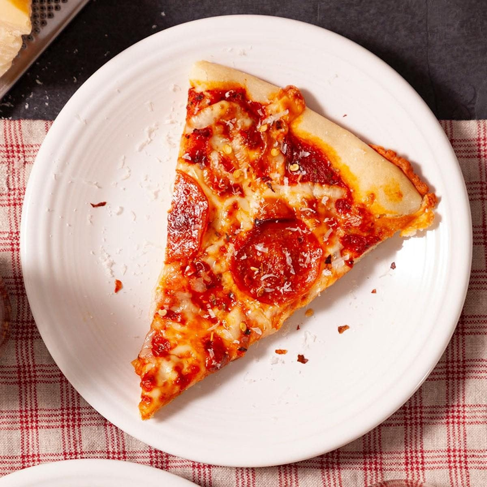
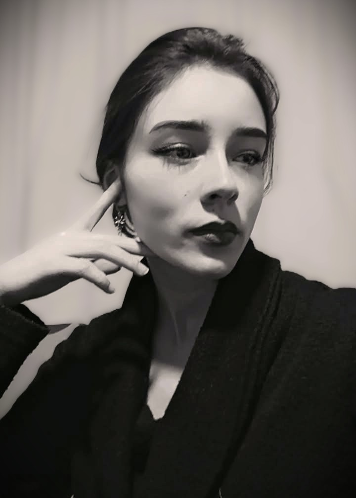

# Unad-Proyect-
## Code & Craft

## Presentación

### Juan Felipe García Cortés

**Ubicación:** El Rosal, Cundinamarca, Colombia

**Rol de la industria:** Technical Artist

### Perfil
Estudiante un enfocado en el desarrollo de entornos y personajes tanto 2D como 3d incluyendo tambien el diseo de sonido, tambien interesado en animaciones y renders usando diferentes programas ya sea Source Film Maker, blender y entre otros

### Plato Favorito
Lasagna

### Fotos

---

### Jhon Alexander Reyes Cristancho

**Rol:** Game developer - Gameplay Programmer 

**Ubicación:** Bogotá, Colombia

**Perfil:** Estudiante interesado en el desarrollo de videojuegos y el diseño de experiencias interactivas, con enfoque en programacion y diseño

---

### Nathaly Andrea Gómez Mora

**Rol:** Gestor de Proyectos Multimedia

**Ubicación:** Albán, Cundinamarca, Colombia

**Perfil:** Estudiante interesada en la planeación, estructuración y consolidación de proyectos multimedia, desde videojuegos hasta plataformas y sitios web. Interesada en participar en la organización y gestión de proyectos que integren diferentes áreas creativas y tecnológicas, contribuyendo a transformar ideas en experiencias digitales estructuradas y funcionales.

### Plato Favorito

